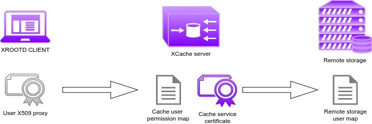
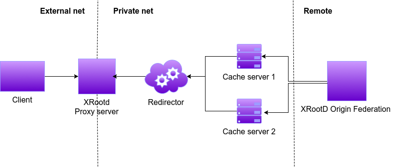

# DEPLOY CACHINGONDEMAND STACK ON K8S

## Requirements

### VM with Vagrant

If you have Vagrant installed or if you want to install it and to use it the following commands are enough to setup a working environment with everything you need for this demo:

```bash
git clone https://github.com/Cloud-PG/CachingOnDemand
cd CachingOnDemand
vagrant up
```

### Manual installation

For part 1:

- [Docker](https://docs.docker.com/install/)
- [Docker compose](https://docs.docker.com/compose/install/)

For part 2:

- [k8s Docker in Docker](https://github.com/kubernetes-sigs/kubeadm-dind-cluster)
- [kubectl](https://kubernetes.io/docs/tasks/tools/install-kubectl/) and [helm](https://helm.sh/docs/using_helm/#installing-helm) installed on the local machine
- remote xrootd host to connect to
- service certificate authorized to read from remote xrootd host
  - kept on your local machine as user{cert,key}.pem
- voms configuration file (optional)
  - kept on your local machine in folder ./vomses

## PART 1

### Playground with Docker and Docker Compose

Please follow the instruction [here](../DOCKER.md)

## PART 2

### Start a local Kubernetes cluster

Let's start a k8s cluster locally with 4 nodes:

```bash
NUM_NODES=3 k8s-dind up
```

The output should be something like:

```text
* Bringing up coredns and kubernetes-dashboard 
deployment.extensions/coredns scaled
deployment.extensions/kubernetes-dashboard scaled
.............[done]
NAME          STATUS   ROLES    AGE     VERSION
kube-master   Ready    master   2m37s   v1.13.0
kube-node-1   Ready    <none>   116s    v1.13.0
kube-node-2   Ready    <none>   116s    v1.13.0
kube-node-3   Ready    <none>   116s    v1.13.0
* Access dashboard at: http://127.0.0.1:32769/api/v1/namespaces/kube-system/services/kubernetes-dashboard:/proxy
```

and dashboard should be accessible at the prompted link.
Now your kube config file has been update so you should be able to query the cluster by:

```bash
kubectl get node
```

### AuthN/Z mode in XCache



1. The client show its identity only to the cache server
2. The cache server will check in its local mapfile if the client is allowed to read the requested namespace
3. If that is the case the cache server will server the file from its disk if already cached or it will use its own certificate (robot/service/power user as needed) to authenticate with the remote storage for the reading process
4. The remote storage check its own mapfile if the robot/service/power user certificate is allowed to read from that namespace.

__N.B.__ a procedure to use a user proxy forwarding approach is available but not recomended for security reasons.

### Store certificates in K8S secrets

Certificates can be saved on k8s and made available to all the cache server with this command:

```bash
kubectl create secret generic certs --from-file=cert.pem=$PWD/usercert.pem --from-file=key.pem=$PWD/userkey.pem
```

For more details about k8s secrets please visit [this page](https://kubernetes.io/docs/concepts/configuration/secret/)

### Store vomses in configmap

Vomses can be saved on k8s and made available to all the cache server with this command:

```bash
kubectl create configmap vomses-config --from-file=vomses/
```

For more details about k8s configMaps please visit [this page](https://kubernetes.io/docs/tasks/configure-pod-container/configure-pod-configmap/)

### Install Helm and Cachingondemand repository

Initialize helm on the cluster and then install the CachingOnDemand repository.

```bash
helm init --upgrade
helm repo add cloudpg https://cloud-pg.github.io/CachingOnDemand/
helm repo update
```

### Taking a look to deployments parameters

The deployment can be tune using the Helm following parameters (either passing them via yaml file or via CLI).

```yaml
cache:
  repository: cloudpg/cachingondemand
  tag: helm
  redir_host: xcache-redir-service.default.svc.cluster.local
  replicas: 1
  cache_host_path: /data/xrd
  block_size: 512k
  mem_gb: 2
  high_wm: 0.95
  low_wm: 0.80
  n_prefetch: 1
  origin_host: cms-xrootd.infn.it
  origin_xrd_port: 1094
  xrdport: 31494
  cmsport: 31113
  streams: 256
  external_ip: 192.168.0.123
  vo: ""
  http_port: 8080

redirector:
  repository: cloudpg/cachingondemand
  tag: helm
  replicas: 1
  xrdport: 31294
  cmsport: 31213

proxy:
  repository: cloudpg/cachingondemand
  tag: helm
  replicas: 1
  external_ip: 192.168.0.123
  xrdport: 31394
```

The default recipe will try to deploy the caching form in the following architecture.



### Deploy the cluster

Let's use the default parameters for now (by default working with CMS remote end point):

```bash
helm install -n cache-cluster cloudpg/cachingondemand
```

the output of the command should look like:

```text
NAME:   cache-demo
LAST DEPLOYED: Fri May 31 14:57:02 2019
NAMESPACE: default
STATUS: DEPLOYED

RESOURCES:
==> v1/Service
NAME                   TYPE      CLUSTER-IP      EXTERNAL-IP    PORT(S)                          AGE
xcache-server-service  NodePort  10.107.22.234   192.168.0.123  31494:31494/TCP,31113:31113/TCP  0s
xcache-redir-service   NodePort  10.110.216.224  192.168.0.123  31294:31294/TCP,31213:31213/TCP  0s
xcache-proxy           NodePort  10.108.121.41   192.168.0.123  31394:31394/TCP                  0s

==> v1/Deployment
NAME        DESIRED  CURRENT  UP-TO-DATE  AVAILABLE  AGE
xredir-pod  1        1        1           0          0s
proxy-pod   1        1        1           0          0s
xcache-pod  1        1        1           0          0s

==> v1/Pod(related)
NAME                         READY  STATUS             RESTARTS  AGE
xredir-pod-8469496c75-mfwmq  0/1    ContainerCreating  0         0s
proxy-pod-64c88f5c75-6p9md   0/1    ContainerCreating  0         0s
xcache-pod-74b94865b4-tlmgb  0/2    ContainerCreating  0         0s

```

### Check the status

If everthing went well, all the pods should be running after a while (varying with your internet connectivity):

```bash
$> kubectl get pod

NAME                          READY   STATUS     RESTARTS   AGE
proxy-pod-7ddbd957-rlndx      1/1     Running    0          16m
xcache-pod-7c4dbd4667-9xhwt   3/3     Running    0          16m
xredir-pod-696c4b764c-d7kjp   1/1     Running    0          16m

```

### Test the functionalities

Now you can log into the client docker and test if you are able to download a file from the remote server through the cache server.

```bash
kubectl exec -ti <xcache-pod ID> -c client bash
export X509_USER_PROXY=/tmp/proxy
xrdcp -v -d2 -f root://cache:32294//myfile.root /dev/null
```

### Customize the deployment: standalone cache server example

The deployment of a standalone cache is possible passing the following values file (values.yaml):

```yaml

cache:
  redir_host: 0.0.0.0

redirector:
  replicas: 0
  cmsport: 31113

proxy:
  replicas: 0

```

Then deploy the server with:

```bash
helm install -n cache-standalone cloudpg/cachingondemand --values values.yaml
```
